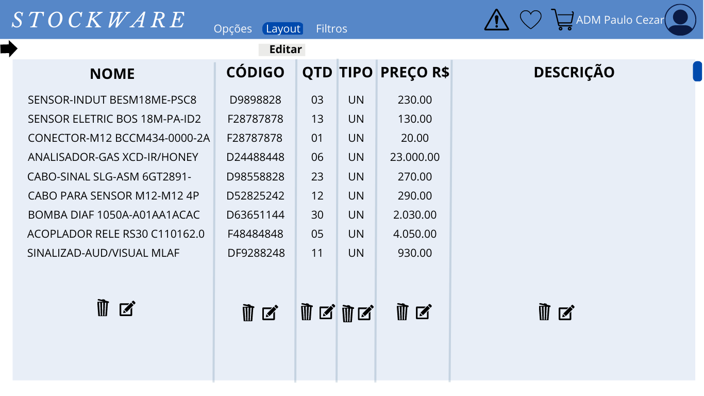

# Projeto de Interface

A interface do sistema foi projetada com foco na usabilidade e experiência do usuário, utilizando design interativo, visando garantir a facilidade de navegação e compreensão das funcionalidades.  

## Fluxo do Usuário  

Nas figuras a seguir consta a representação visual da interação do usuário e administrador com o sistema. 

[link Fluxo do usuário](https://www.canva.com/design/DAFgZZGWFiI/YPCpe0TpCxsvL6zmTp8ZFw/view?utm_content=DAFgZZGWFiI&utm_campaign=designshare&utm_medium=link&utm_source=publishsharelink)

[Link Wireframe Canva](https://www.canva.com/design/DAFgFftKRoY/N6YyGuvak7SBy0QgmF6TiA/edit?utm_content=DAFgFf)
  
 
 Figura 01 - Fluxo do Usuário 

## Fluxo do Administrador 

 
 Figura 02 - Fluxo do Administrador 

## Wireframes

De acordo com o fluxo de interface do projeto exposto na seção anterior, os detalhes das telas do sistema são apresentados nas seções subsequentes. As telas do sistema possuem uma estrutura interativa e de fácil usabilidade, a qual é ilustrada na figura 4. Essa estrutura é composta por dois blocos principais, os quais são representados a seguir: 
 
•	O primeiro é o cabeçalho, onde é exibido o menu de navegação, nome do usuário, logotipo do sistema e as demais opções: campo de busca, carrinho, favoritos e logout.

•	O segundo é o conteúdo, que é exibido na tela conforme a navegação do usuário com o cabeçalho; 

. 

 
 Figura 03 - Wireframes 
 

## Tela – Login (perfil usuário e administrador)

A tela login permite o usuário fazer login no sistema ao preencher os campos: usuário (nome de usuário) e senha; e por fim clicar no botão entrar para concluir a ação. As informações de login serão fornecidas ao usuário pelo administrador.

  
 Figura 04 - Tela – Login (perfil usuário e administrador) 
 

## Tela – Lista de materiais (perfil usuário)

A tela Lista de materiais exibe ao usuário uma lista com todos os produtos cadastrados no sistema e suas principais informações, o campo localizar permite o usuário descrever o material desejado clicando no ícone lupa para concluir sua busca.

  
  Figura 05 - ela – Lista de materiais (perfil usuário) 
 

Ao clicar ao algum item da lista de materiais, o sistema exibe na lateral direita a descrição do produto e sua imagem, nesta sessão o sistema permite a ação adicionar ao carrinho ou adicionar aos favoritos, clicando nos respectivos ícones.

  
 Figura 06 - ela – Lista de materiais (perfil Admin) 
 

## Tela – Filtros (perfil usuário e administrador)

A Tela filtros permite o usuário localizar determinado produto através de campos de filtros, sendo eles, nome, local de instalação, categoria, quantidade e preço, ao clicar e localizar, o usuário é direcionado a tela do produto quando o mesmo for localizado.

 
  Figura 07 - Tela – Filtros (perfil usuário e administrador) 
 

## Tela - Carrinho (perfil usuário e administrador)

Na tela do carrinho, o usuário pode visualizar uma lista de todos os produtos que foram escolhidos, com o somatório do valor total em reais (R$), podendo também excluir um determinado item pelo ícone da lixeira. Nessa tela, há a possibilidade de realizar a solicitação da reserva do(s) produto(s) desejado(s) através do botão "Solicitar Reserva", o qual direciona a solicitação para futura aprovação da reserva pelo administrador.

  
 Figura 08 - Tela - Carrinho (perfil usuário e administrador) 
 

## Tela - Número de solicitação de reserva (perfil usuário e administrador)

Após a solicitação de reserva, o usuário receberá um código de 6 dígitos referentes àquela solicitação. Tal código será usado pelo administrador posteriormente para aprovação de retirada dos produtos do pedido no almoxarifado. 

 
  Figura 09 - Tela - Número de solicitação de reserva (perfil usuário e administrador) 
 

## Tela principal (perfil usuário e administrador) 

A tela principal pode ser de usuário ou administrador. A tela de usuário é composta por três conteúdos: lista de materiais, devolução e consultar reserva. Além disso, no cabeçalho, são apresentados os materiais marcados como favoritos e os que estão no carrinho. 
 
No perfil do administrador, a tela principal é composta por mais componentes, pois ele é responsável pelo gerenciamento do sistema. Entre os componemtes, podemos citar: lista de materiais, devolução, gerenciamento de reserva, cadastro de usuário, cadastro de materiais e histórico de produtos. Além disso, no cabeçalho, é exibido um ícone de uma notificação de alerta de estoque abaixo. 

  
 Figura 10 - Tela principal (perfil usuário)  
 
  
 Figura 11- Tela principal (perfil administrador)  
 

## Tela - Devolução (perfil usuário e administrador) 

Na tela de devolução, após o solicitante ter o código de 6 dígitos, ele poderá fazer a devolução dos produtos rejeitados. Para os produtos que não deseja devolver, basta clicar na lixeira. Além disso, serão apresentados os detalhes do pedido e o solicitante deve informar o motivo da devolução e a data atual. Para solicitar a devolução, basta clicar em "SOLICITAR DEVOLUÇÃO".

 
  Figura 12 - Tela - Devolução (perfil usuário e administrador)  
 

## Tela - Solicitação de devolução (perfil usuário e administrador) 

Após a solicitação de devolução, será apresentado o mesmo código de 6 dígitos referente à solicitação. Tal código será usado posteriormente para que haja a devolução do(s) produto(s) do pedido. Neste caso, o usuário também tem a opção de salvar/imprimir a sua solicitação de devolução através do botão "Imprimir".

 
  Figura 13 - Tela - Solicitação de devolução (perfil usuário e administrador)  
 

## Tela - Favoritos (perfil usuário e administrador) 

Na tela favoritos, o usuário tem a oportunidade de visualizar através de uma lista todos os produtos os quais foram escolhidos como favoritos, tendo a opção de selecionar cada um dos produtos e visualizar seus detalhes, ou a opção de adicionar ao carrinho (este ou àquele produto), podendo também remover dos favoritos pelo botão “lixeira”. O botão para visualizar os favoritos é o ícone do “coração”.

  
 Figura 14 - Tela - Favoritos (perfil usuário e administrador)  
 

## Tela – Consultar reserva (perfil usuário) 

Nesta tela, o usuário que já fez a sua solicitação de algum(ns) produto(s) poderá acompanhar o status atual daquele pedido, podendo saber se o mesmo foi aprovado pelo administrador e se os produtos já foram retirados do estoque.

  
 Figura 15 - Tela – Consultar reserva (perfil usuário)  
 

##   Tela principal - (perfil administrador) 

Pela tela principal o administrador ou usuário, pode fazer logout (sair da conta)

  
 Figura 16 - Tela principal - (perfil administrador)  
 

Na tela principal, será apresentado ao administrador um alerta sempre que um determinado material atingir uma quantidade mínima ou zerar o estoque. 

 
  Figura 17 - Tela principal - (perfil administrador)  
 

## Tela – Lista de materiais (perfil administrador)

Ao clicar em algum item da lista de materiais, o sistema exibe na lateral direita a descrição do produto e sua imagem, nesta sessão o sistema permite ao administrador editar, excluir, adicionar ao carrinho e adicionar aos favoritos aquele determinado produto, através dos seus respectivos ícones.

  
 Figura 18 - Tela – Lista de materiais (perfil administrador) 
 

## Tela – Cadastrar materiais (perfil administrador) 

O administrador registrará novos materiais no sistema, colocando informações relevantes como nome, código, quantidade, tipo: se é unidade (UN), peça (PC) ou metro (M), e entre outras informações. Após a conclusão, o ADM (Administrador) salvará o cadastro e o material será registrado no sistema. 

  
 Figura 19 - Tela – Cadastrar materiais (perfil administrador)  
 

## Tela – Editar material (perfil administrador) 

Ao clicar no botão "editar", o sistema permite o administrador atualizar os dados cadastrados do material. 

  
 Figura 20 - Tela – Editar material (perfil administrador)  
 

## Tela – Histórico de produtos (perfil administrador) 

Pela tela de histórico de produtos, o administrador pode consultar as informações de cada um dos materiais. A partir do momento em que procurar por um determinado material pelo histórico, será possível verificar as últimas requisições do material, a data, a quantidade e o número da reserva. 

  
 Figura 21 - Tela – Histórico de produtos (perfil administrador)  
 

## Tela - Editar temas (perfil administrador e usuário) 

O administrador e usuário podem editar o tema do layout do sistema, ao clicar na opção layout e depois temas.

 
  Figura 22 - Tela - Editar temas (perfil administrador e usuário)  
 

## Tela - Editar layout - (perfil administrador e usuário) 

Na tela principal, ao clicar em "layout" e "editar", será possível a personalização dos nomes apresentados nas colunas, como nome, código, quantidade, tipo, preço e descrição. Também é possível excluir uma coluna selecionada. 

 
  Figura 23 - Tela - Editar layout - (perfil administrador e usuário)  
 

## Tela – Gerenciamento de reserva (perfil administrador) 

Pela tela de gerenciamento de reservas, o administrador pode verificar as informações do material, podendo aprovar o material para retirada e até mesmo excluir um determinado material da lista. Ao final, será apresentado o valor total dos materiais. 

  
 Figura 24 - Tela – Gerenciamento de reserva (perfil administrador)  
 

##   Tela – Cadastrar usuário (perfil administrador)

A tela cadastro de usuário, permite o administrador cadastrar usuários para utilizarem o sistema, é necessário preencher os seguintes campos: Nome, nome de usuário, senha e confirmação de senha, para finalizar o cadastro basta clicar no botão criar. O sistema permite selecionar as opções: usuário ou ADM, permitindo acesso as funcionalidades respectivas de cada função para aquele determinado usuário.

 
  Figura 25 - Tela – Cadastrar usuário (perfil administrador) 
 

