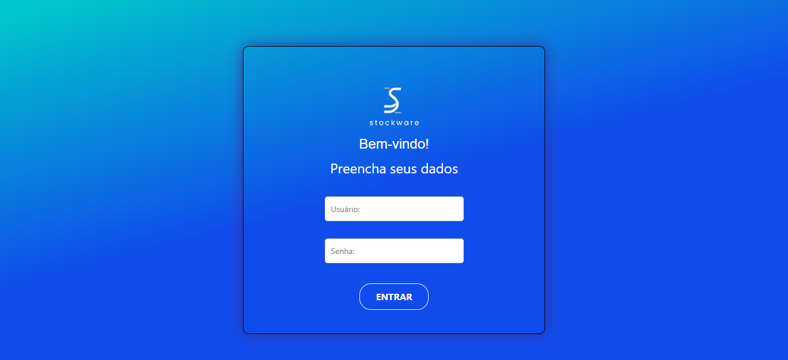

# Template padrão do site 

 O design do layout a ser utilizado no sistema, segue  a disposição proposta pela Figura 01 - Wireframe.

   Figura 01 - Wireframe 

 

### Login:

 Permite ao usuário acessar o sistema ao preencher os campos solicitados, esse acesso pode ser tanto de usuário ou admin, sendo que admin contém recursos adicionais. Requisitos funcionais atendidos: RF-01.

  Figura 02 - Tela de login

 

### Home:
 Permite ao usuário navegar pelas funcionalidades existentes no sistema, sendo que ao acessar a conta pelo perfil de admin, recursos como "Cadastrar materiais" são incluidos no menu lateral do sistema.  Requisitos funcionais atendidos: RF-10.

  Figura 03 - Tela de home 

 

### Lista de materiais:

  Permite ao usuário consultar todos os materiais disponíveis, apresentando um feed de produtos, cada produto apresentado contem sua imagem, quantidade disponível, além de suas informações de cadastro. Requisitos funcionais atendidos: RF-07.

 Figura 04 - Tela lista de materiais 

 

### Carrinho:

Permite ao usuário requisitar mais de um produto por operação, os produtos selecionados ficarão salvos no carrinho. Ao acessar o carrinho será apresentado as mesmas informações contidas em "Lista de materiais" Requisitos funcionais atendidos: RF-08.

  Figura 05 - Tela carrinho 

 

### Mensagem de status - Carrinho:

Apresenta uma mensagem de status de requisição ao usuário assim que finalizar o processo, esse códiogo de 6 dígitos será utilizado para que o admin do sistema possa realizar a aprovação e consulta dos materiais contidas na solicitação. Requisitos funcionais atendidos: RF-09.

  Figura 06 - Mensagem de status - Carrinho 