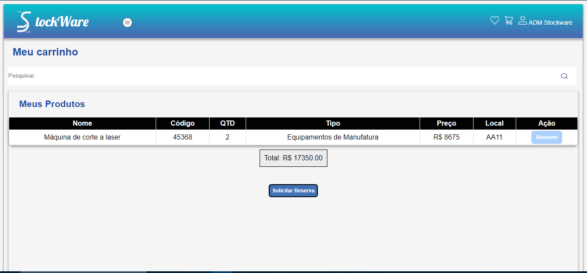
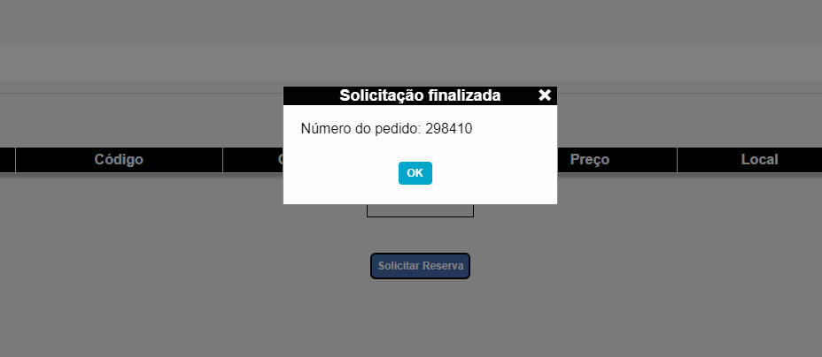

# Programação de Funcionalidades

Serão apresentadas a seguir as telas referentes aos requisitos funcionais atendidos, suas respectivas URLs e outras orientações de acesso.

 

# Cadastro de materiais (RF-02):

A tela de cadastro de materiais permite ao administrador cadastrar um determinado material no sistema, incluindo informações relevantes para futuras análises e comparações de produtos.

  Figura 01 - Cadastro de materiais

## Requisitos atendidos:

RF-02 

## Artefatos da funcionalidade:

●	Produtc-registration.html  
●	script.js  
●	Produtc-registration.css  

## Instruções de acesso:

1.	Faça o download do arquivo do projeto (ZIP) ou clone do projeto no GitHub através do link: https://github.com/ICEI-PUC-Minas-PMV-ADS/pmv-ads-2023-1-e1--proj-web-t8-stockware;  

2.	Abra o Visual Studio Code e execute o Live Server;  

3.	Abra um navegador de Internet e digite a seguinte URL: http://127.0.0.1:5500/;  

4.	Faça o login como administrador, informando o usuário e a senha;  

5.	Acesse o menu lateral esquerdo e selecione a opção "Cadastrar produtos";  

6.	Preencha todos os dados do material e, por fim, clique em "Cadastrar";  

7.	O material cadastrado será apresentado na tela de lista de materiais.  

## Estrutura de dados:

[{nome: "Máquina de corte a laser", codigo: "45368", quantidade: "2",…},…] 
0:  

{nome: "Máquina de corte a laser", codigo: "45368", quantidade: "2",…} 

codigo: "45368" 

descricao: "A máquina de corte a laser (modelo 123456) é uma ferramenta avançada para corte preciso e rápido de materiais metálicos e não metálicos. Equipada com um potente laser de alta intensidade, esta máquina é capaz de cortar uma variedade de materiais, como aço inoxidável, alumínio, acrílico e madeira. Com um sistema de controle computadorizado, a máquina oferece precisão milimétrica, permitindo a criação de formas complexas com bordas perfeitamente cortadas." 

imagem: "https://cdn.awsli.com.br/600x450/1328/1328750/produto/62401216/bc101a8d35.jpg" 

local: "AA11" 

nome: "Máquina de corte a laser" 

preco: "8675" 

quantidade: "2" 

tipo: "Equipamentos de Manufatura" 

1: {nome: "Motor Elétrico de Alta Performance", codigo: " 234567", quantidade: "5", tipo: "Eletrônico",…}
2: {nome: "Célula Robótica de Soldagem ", codigo: "345678", quantidade: "1",…}
3: {nome: "Compressor de Ar de Parafuso", codigo: "456789 ", quantidade: "3", tipo: "Pneumático",…}

 

# Lista de materiais (RF-07)

A tela lista de materiais apresenta todos os materiais cadastrados e suas respectivas informações conforme cadastro realizado. Pela opção "pesquisar" é possivel localizar um determinado material digitando alguma palavra chave, tais como: nome, código, local.

  Figura 02 - Lista de materiais 

## Requisitos atendidos:
●	RF-07

## Artefatos da funcionalidade:
●	list.html  
●	script.js  
●	list.css  

## Instruções de acesso:

1.	Após realizar o login com a conta de usuário ou administrador, acesse o menu lateral esquerdo;  

2.	Selecione a opção "Lista de materiais" ou acesse o link http://127.0.0.1:5500/pages/list.html para visualizar a lista de todos os materiais cadastrados.

 

# Carrinho (RF-08)
Na tela carrinho serão apresentados todos os materiais que o usuário deseja requisitar, após conferir os materiais desejados e a quantidade, o mesmo poderá finalizar o pedido.

  Figura 03 - Carrinho

## Requisitos atendidos:
●	RF-08

## Artefatos da funcionalidade:
●	Cart-page.html 
●	cart-page.js 
●	Cart-page.css 

## Instruções de acesso:

1.	Através de qualquer tela, acesse o cabeçalho e clique no ícone de “carrinho”;  

2.	Todos os materiais desejados para requisição serão apresentados.

 

# Mensagem de status após requisição de produtos (requisição de material) (RF-09)

Após finalizar um pedido de requisição através do “carrinho”, será apresentado um código referente ao número de pedido. 

  Figura 04 - Mensagem de status 

## Requisitos atendidos:
●	RF-08

## Artefatos da funcionalidade:
●	Cart-page.html  
●	cart-page.js  
●	Cart-page.css  

## Instruções de acesso:

1.	A mensagem de status será apresentada sempre que finalizar um pedido de requisição.

