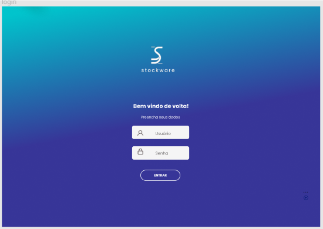
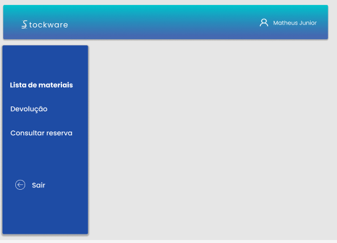
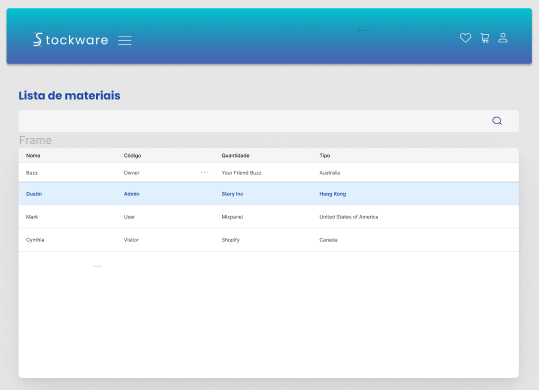

# Template padrão do site 

 O design do layout a ser utilizado no sistema, segue  a disposição proposta pela figura 4, como apresentado anteriormente no projeto de interface.

 (img/templatesw.png)

Tela de login, permite ao usuário acessar o sistema ao preencher os campos solicitados. Requisitos funcionais atendidos: RF-01

Tela de home, permite ao usuário navegar pelas funcionalidades existentes no sistema.  Requisitos funcionais atendidos: RF-10

Tela lista de materiais, permite ao usuário localizar o material desejado, bem como outras funcionalidades descritas na seção lista de materiais descritas anteriormente no projeto de interface. Requisitos funcionais atendidos: RF-06

