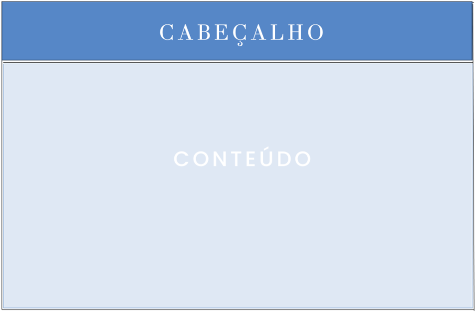
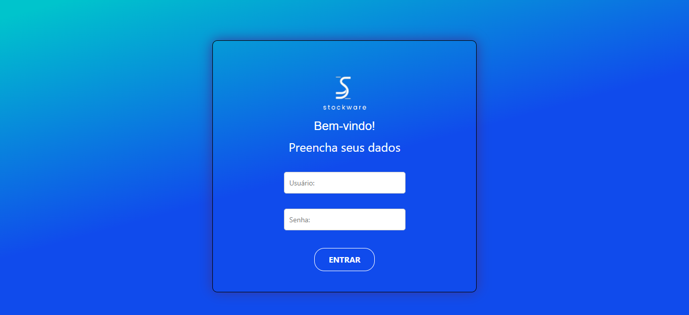
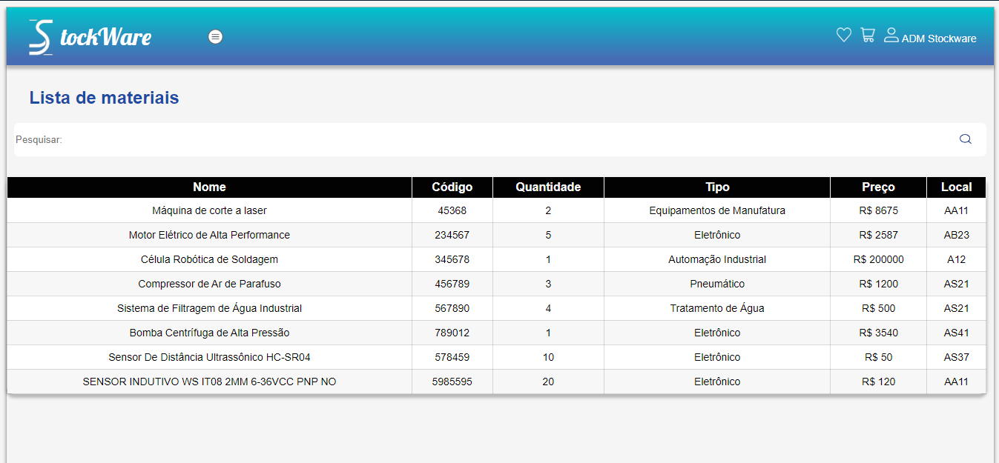

# Template padrão do site 

 O design do layout a ser utilizado no sistema, segue  a disposição proposta pela Figura 01 - Wireframe.

   Figura 01 - Wireframe 

 
 
##Tela de login:## Permite ao usuário acessar o sistema ao preencher os campos solicitados. Requisitos funcionais atendidos: RF-01.

  Figura 02 - Tela de login

 
 
##Tela de home:## Permite ao usuário navegar pelas funcionalidades existentes no sistema.  Requisitos funcionais atendidos: RF-10.

 Figura 03 - Tela de home 

 
 
##Tela lista de materiais:## Permite ao usuário localizar o material desejado, bem como outras funcionalidades descritas na seção lista de materiais descritas anteriormente no projeto de interface. Requisitos funcionais atendidos: RF-06.

 Figura 04 - Tela lista de materiais 

