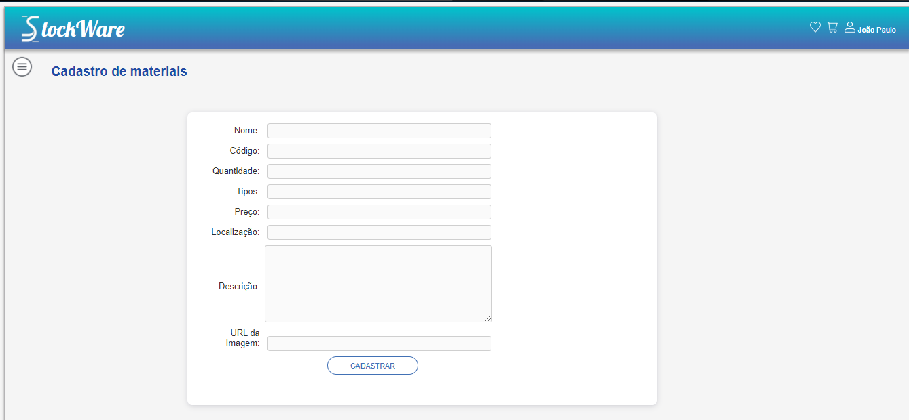
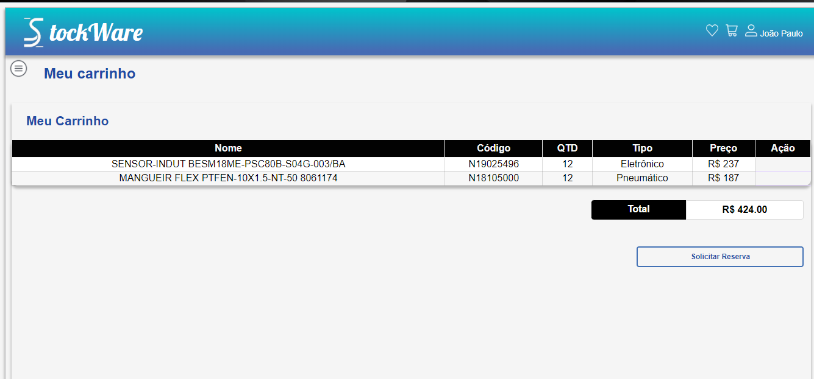

# Programação de Funcionalidades

Pré-requisitos: <a href="2-Especificação do Projeto.md"> Especificação do Projeto</a>, <a href="3-Projeto de Interface.md"> Projeto de Interface</a>, <a href="4-Metodologia.md"> Metodologia</a>, <a href="3-Projeto de Interface.md"> Projeto de Interface</a>, <a href="5-Arquitetura da Solução.md"> Arquitetura da Solução</a>

Serão apresentadas a seguir as telas referentes aos requisitos funcionais atendidos, suas respectivas URLs e outras orientações de acesso.

# Cadastro de materiais (RF-02):

A tela de cadastro de materiais permite ao administrador cadastrar um determinado material no sistema.

**Requisitos atendidos:**
●	RF-02 

**Artefatos da funcionalidade:**
●	Produtc-registration.html
●	script.js
●	Produtc-registration.css

**Estrutura de Dados**

**Instruções de acesso**

1.	Faça o download do arquivo do projeto (ZIP) ou clone do projeto no GitHub através do link: https://github.com/ICEI-PUC-Minas-PMV-ADS/pmv-ads-2023-1-e1--proj-web-t8-stockware;

2.	Abra o Visual Studio Code e execute o Live Server;

3.	Abra um navegador de Internet e digite a seguinte URL: http://127.0.0.1:5500/;

4.	Faça o login como administrador, informando o usuário e a senha;

5.	Acesse o menu lateral esquerdo e selecione a opção "Cadastrar produtos";

6.	Preencha todos os dados do material e, por fim, clique em "Cadastrar";

7.	O material cadastrado será apresentado na tela de lista de materiais.

# Lista de materiais (RF-07)

A tela lista de materiais apresenta todos os materiais cadastrados e suas respectivas informações.

**Requisitos atendidos**
●	RF-07

**Artefatos da funcionalidade**
●	list.html
●	script.js
●	list.css

Estrutura de Dados

Instruções de acesso

1.	Após realizar o login com a conta de usuário ou administrador, acesse o menu lateral esquerdo;

2.	Selecione a opção "Lista de materiais" ou acesse o link http://127.0.0.1:5500/pages/list.html para visualizar a lista de todos os materiais cadastrados.

# Carrinho (RF-08)
Na tela carrinho serão apresentados todos os materiais que o usuário deseja requisitar, após conferir os materiais desejados, o mesmo poderá finalizar o pedido.

**Requisitos atendidos**
●	RF-08

**Artefatos da funcionalidade**
●	Cart-page.html
●	script.js
●	Cart-page.css

**Estrutura de Dados**

**Instruções de acesso**

1.	Através de qualquer tela, acesse o cabeçalho e clique no ícone de “carrinho”;

2.	Todos os materiais desejados para requisição serão apresentados.

# Mensagem de status (requisição de material) (RF-09)

Após finalizar um pedido de requisição através do “carrinho”, será apresentado um código referente ao número de pedido. 

**Requisitos atendidos**
●	RF-08

**Artefatos da funcionalidade**
●	Cart-page.html
●	script.js
●	Cart-page.css

**Estrutura de Dados**

**Instruções de acesso**

1.	A mensagem de status será apresentada sempre que finalizar um pedido de requisição.

