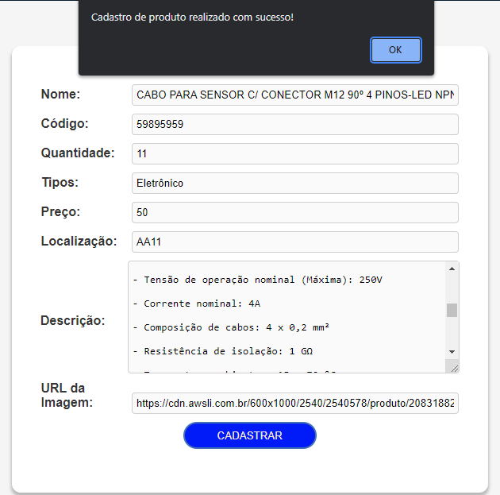
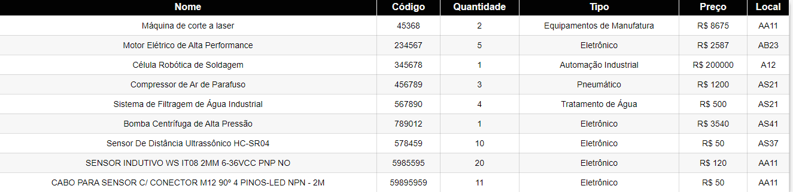
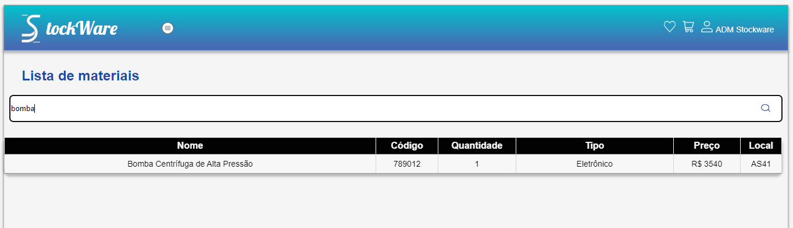
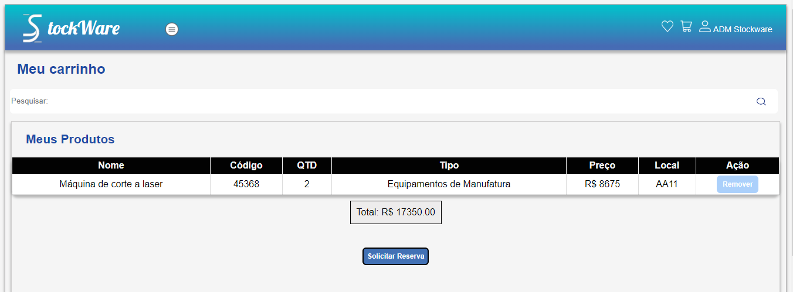

# Registro de Testes de Software

Pré-requisitos: <a href="3-Projeto de Interface.md"> Projeto de Interface</a>, <a href="8-Plano de Testes de Software.md"> Plano de Testes de Software</a>

Relatório com as evidências dos testes de software realizados no sistema pela equipe, baseado em um plano de testes pré-definido.
 

## Registro de teste 01:

Notificação caso o usuário não preencha todos os campos obrigatórios.

   
  Figura 01 - Notificação 01 

 

## Registro de teste 02:

Notificação após o usuário preencher todos os campos obrigatórios  e clicar em cadastrar.

  
  Figura 02 -  Notificação 02

 

## Registro de teste 03:

Limpar formulário após finalizar cadastro.

  
 Figura 03 - Limpar formulário 

 

## Registro de teste 04:

Material sendo registrado corretamente na tela de lista de materiais.

  
 Figura 04 -  Material sendo registrado

 

## Registro de teste 05:

Funcionalidade de pesquisar por um determinado produto utilizando palavras chaves.

  
 Figura 05 - Pesquisar por produto 

 

## Registro de teste 06:

Funcionalidade de adicionar material ao carrinho dentro do campo de descrição do material.

**Pendências**
Falta subtrair a quantidade de materias do estoque após requisição e a aprovação do pedido pelo admin.

  
 Figura 06 - Adicionar material ao carrinho 

 

## Registro de teste 07:

Notificação ao adicionar material ao carrinho, caso o mesmo já exista no carrinho uma mensagem informativa é apresentada.

  
 Figura 07 -  Notificação
 

## Registro de teste 08:

Material sendo transferido para tela de carrinho.

  
 Figura 08 - Material transferido 

 

## Registro de teste 09:

Notificação após o usuário finalizar pedido de requisição de materiais.

 
  Figura 09 -  Notificação

 

## Registro de teste 10:

Notificação ao adicionar material aos favoritos, caso o mesmo já exista nos favoritos uma mensagem informativa é apresentada.

 
 Figura 10 -  Notificação
 

## Avaliação:

Durante os testes, foram indentificadas funcionalidades bem-sucedidas assim como também foram identificados pendências, após a implementação de melhorias, o objetivo é apresentar um sistema estável e confiável. 

