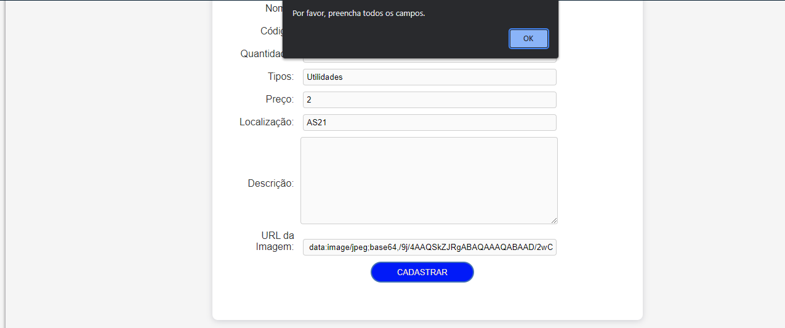
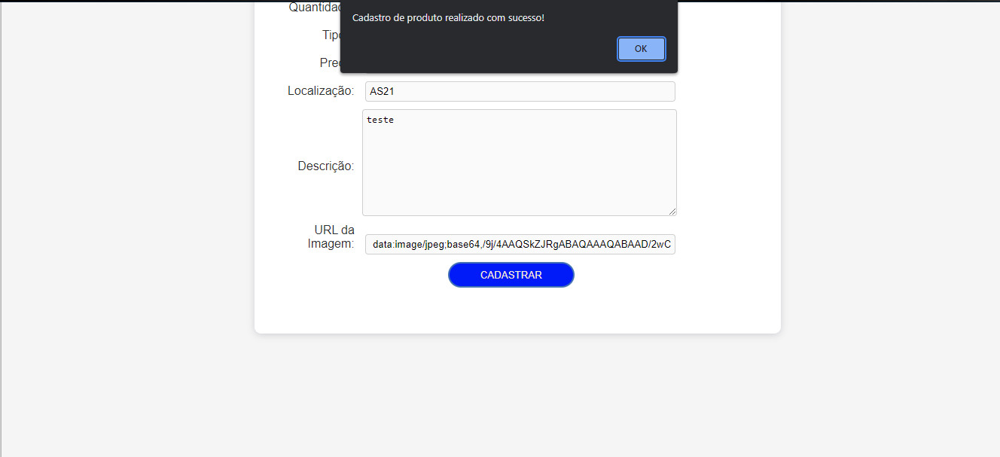
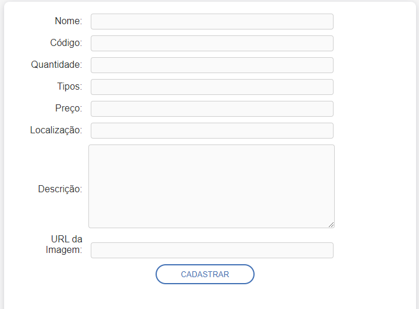
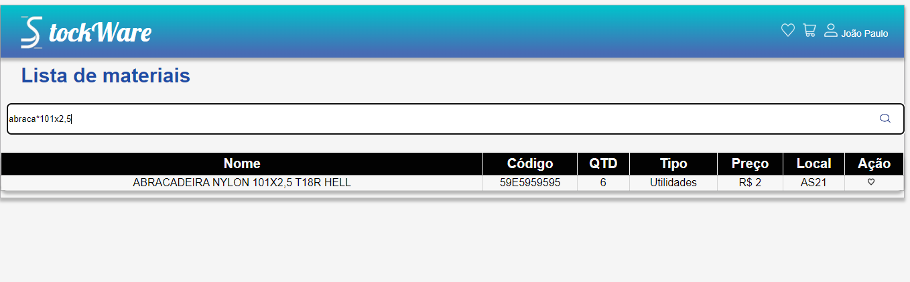
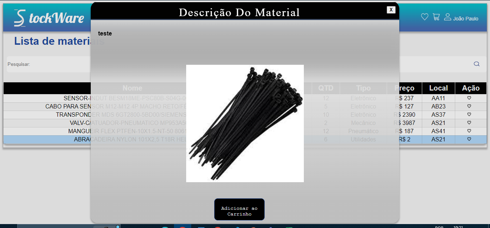
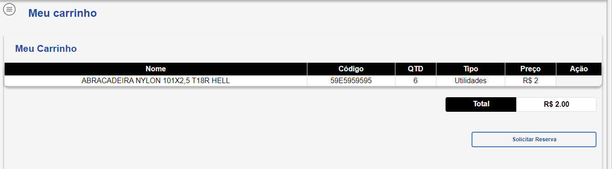
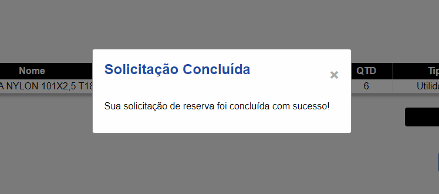

# Registro de Testes de Software

Pré-requisitos: <a href="3-Projeto de Interface.md"> Projeto de Interface</a>, <a href="8-Plano de Testes de Software.md"> Plano de Testes de Software</a>

Relatório com as evidências dos testes de software realizados no sistema pela equipe, baseado em um plano de testes pré-definido.

## Registro de teste 01:

Notificação caso o usuário não preencha todos os campos obrigatórios.

## Registro de teste 02:

Notificação após o usuário preencher todos os campos obrigatórios  e clicar em cadastrar.

## Registro de teste 03:

Limpar formulário após finalizar cadastro.

## Registro de teste 04:

Material sendo registrado corretamente na tela de lista de materiais.

## Registro de teste 05:

Funcionalidade de pesquisar por um determinado produto utilizando palavras chaves através do caractere (*) 

## Registro de teste 06:

Funcionalidade de adicionar material ao carrinho dentro do campo de descrição do material.

## Registro de teste 07:

Notificação ao adicionar material ao carrinho.

## Registro de teste 08:

Material sendo transferido para tela de carrinho.

## Registro de teste 09:

Notificação após o usuário finalizar pedido de requisição de materiais.

## Avaliação

Discorra sobre os resultados do teste. Ressaltando pontos fortes e fracos identificados na solução. Comente como o grupo pretende atacar esses pontos nas próximas iterações. Apresente as falhas detectadas e as melhorias geradas a partir dos resultados obtidos nos testes.

