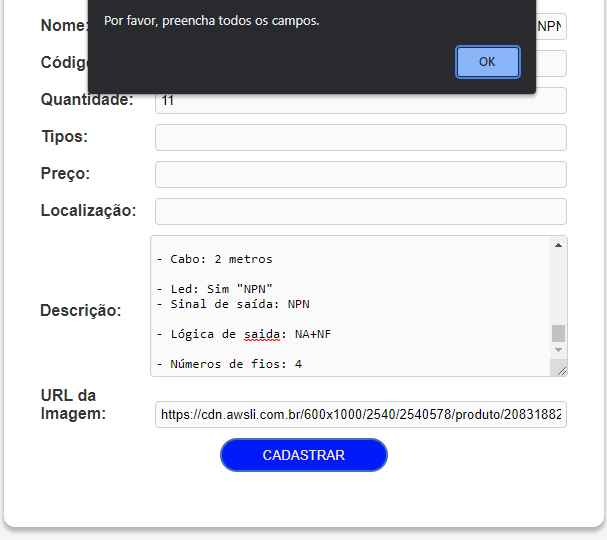
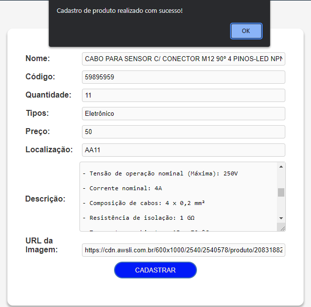
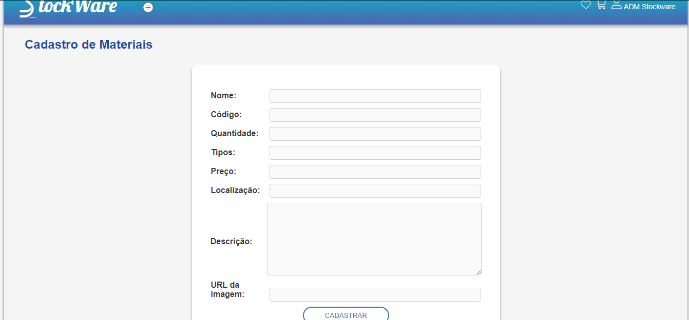
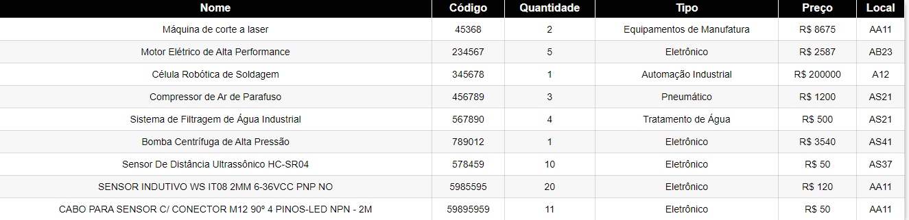
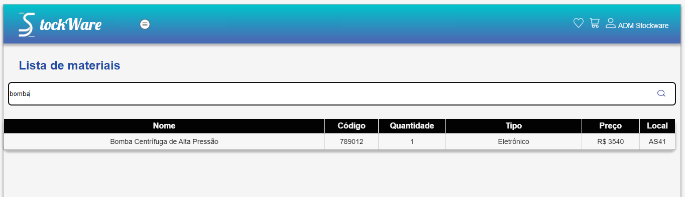
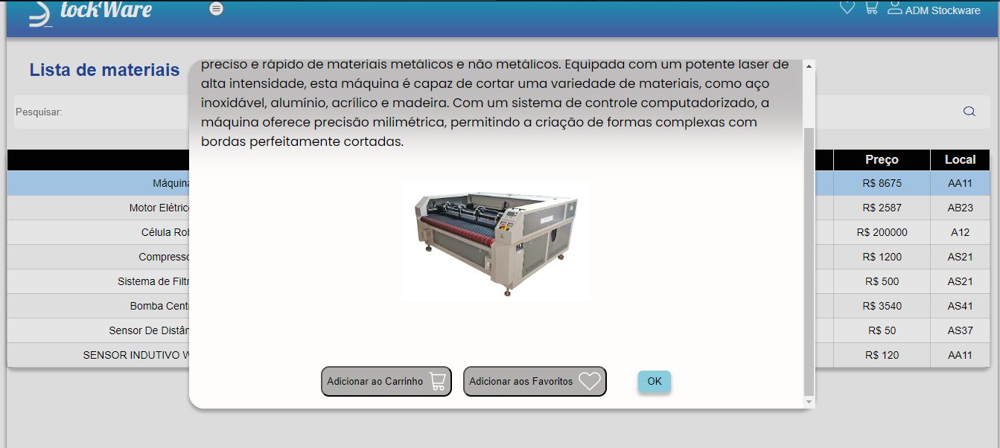
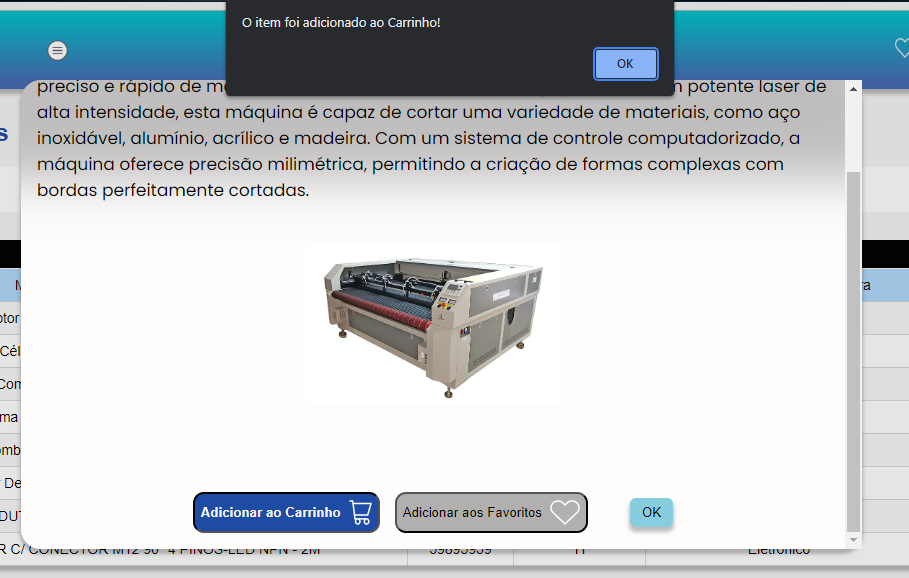
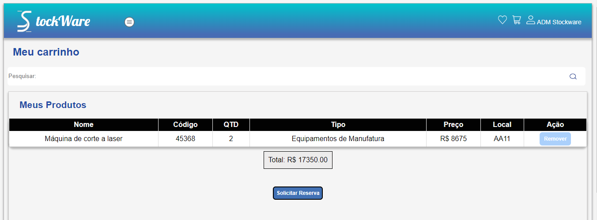
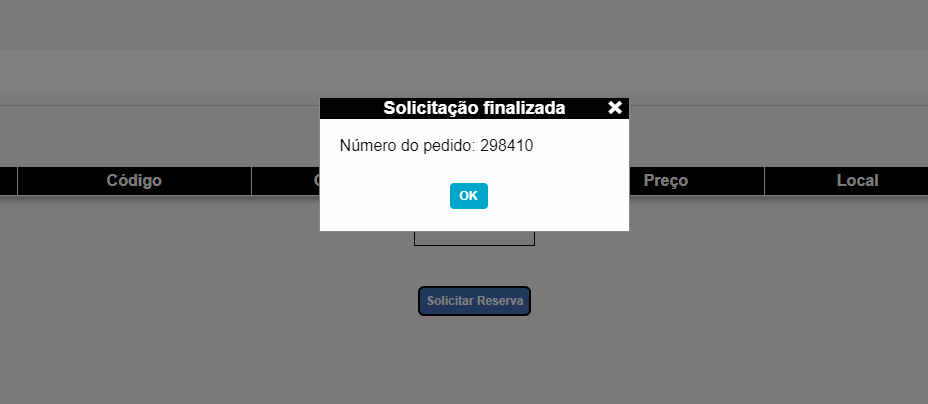
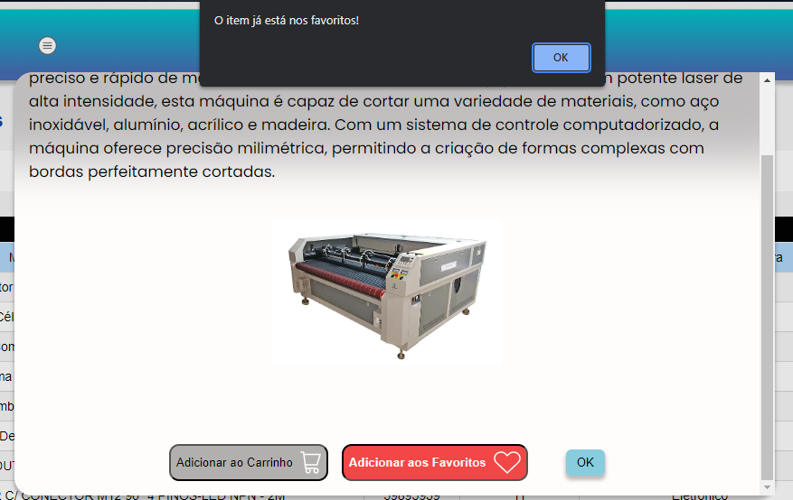

# Registro de Testes de Software

Pré-requisitos: <a href="3-Projeto de Interface.md"> Projeto de Interface</a>, <a href="8-Plano de Testes de Software.md"> Plano de Testes de Software</a>

Relatório com as evidências dos testes de software realizados no sistema pela equipe, baseado em um plano de testes pré-definido.

## Registro de teste 01:

Notificação caso o usuário não preencha todos os campos obrigatórios.

   
  Figura 01 - Notificação 

## Registro de teste 02:

Notificação após o usuário preencher todos os campos obrigatórios  e clicar em cadastrar.

.
  Figura 02 -  Notificação

## Registro de teste 03:

Limpar formulário após finalizar cadastro.

. 
 Figura 03 - Limpar formulário 

## Registro de teste 04:

Material sendo registrado corretamente na tela de lista de materiais.

. 
 Figura 04 -  Material sendo registrado

## Registro de teste 05:

Funcionalidade de pesquisar por um determinado produto utilizando palavras chaves através do caractere (*) 

. 
 Figura 05 - Pesquisar por produto 

## Registro de teste 06:

Funcionalidade de adicionar material ao carrinho dentro do campo de descrição do material.

**Falhas encontradas:**
Botão de adicionar ao carrinho fora de posição dependendo do tamanho da imagem.

**Solução:**
Corrigir a responsividade da tela de descrição de materiais.

. 
 Figura 06 - Adicionar material ao carrinho 

## Registro de teste 07:

Notificação ao adicionar material ao carrinho.

. 
 Figura 07 -  Notificação

## Registro de teste 08:

Material sendo transferido para tela de carrinho.

**Falhas encontradas:**
1 - Somatório total dos produtos não corresponde ao total de produtos selecionados no carrinho.

2 - Não permite ao usuário escolher a quantidade de materiais desejados.

**Solução:**
1 - Corrigir lógica de cálculo referente a quantidade de produtos adicionados ao carrinho.

2 - Implementar opção de escolha da quantidade de podutos desejados pelo usuário.

. 
 Figura 08 - Material transferido 

## Registro de teste 09:

Notificação após o usuário finalizar pedido de requisição de materiais.

**Pontos fracos:**
Não apresenta número aleatório para aprovação de reserva solicitada.

**Solução:**
 Implementar gerador de números aleatórios contendo 6 números usando javascript.
.
  Figura 09 -  Notificação

## Registro de teste 10:

Notificação ao adicionar material aos favoritos.

. 
 Figura 10 -  Notificação

## Avaliação

Durante os testes, foram indentificadas funcionalidades bem-sucedidas assim como também foram identificadas falhas, após a implementação de melhorias, o objetivo é apresentar um sistema estável e confiável. 

